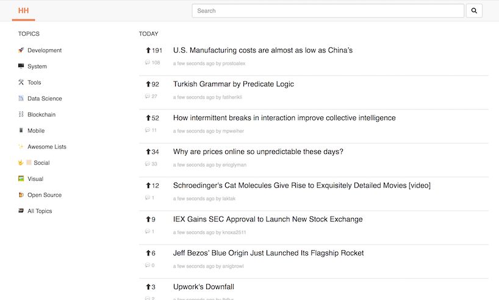
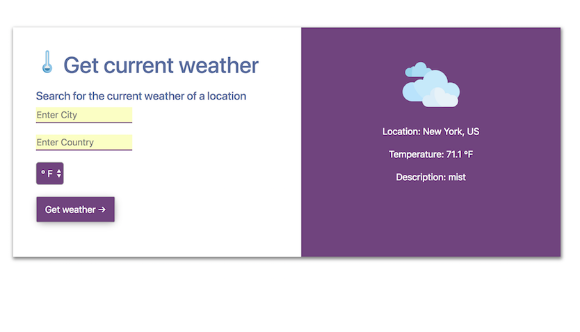
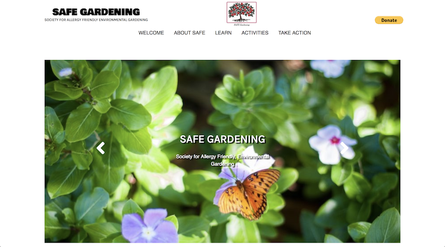

### LeetUp (MeetUp Clone)

Project made for Chingu Voyage 5. Team mates: @ivanms1 and @mepda

**Stack:** React, React's Context API, Express/Node, MongoDB.
**Idea:** A Meetup-like events page for tech/developer-related events only.

[**Code**](https://github.com/chingu-voyage5/Geckos-Team-43)
[**Live Demo**](https://github.com/chingu-voyage5/Geckos-Team-43)

### HackerHunt (HackerHunt Clone)

Personal Project. Bootstrapped with CRA, getting stories from HackerNews API.

**Stack:** React.
**Idea:** Copy work project to learn React

[**Code**](https://github.com/Sosodope/hackerhunt-clone)
[**Live Demo**](http://hackerhunt-clone-sdp.surge.sh/)

### Weather App

Personal Project. Bootstrapped with CRA, getting current weather data for location from OpenWeather API.

**Stack:** React.
**Idea:** Copy work project to learn React

[**Code**](https://github.com/Sosodope/weather-app)
[**Live Demo**](https://locationcurrentweather.herokuapp.com/)

### SAFE Gardening

Website for SAFE Gardening, a non-profit organization. Original website made with HTML/JS/Sass.

Later on converted to WordPress website using Underscores (WordPress Starter Theme)

**Stack:** HTML, Sass, JavaScript and WordPress.

**Idea:** Move previous site from Joomla and provide a clean, modern, responsive website for the SAFE team.

[**Code**](https://github.com/chingu-voyage4/Geckos-Team-15)
[**Live Demo**](http://www.safegardening.org/)
